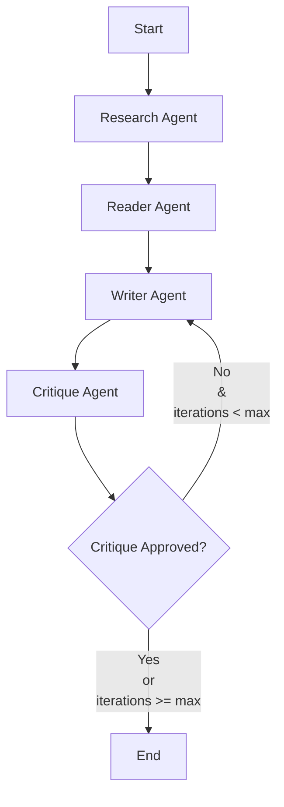

# Multi-Agent AI Research Assistant Backend

An agentic AI research pipeline that gathers search results, scrapes content, synthesizes structured reports, and conducts iterative critique/grounding cycles before finalizing drafts.

Built with **FastAPI**, **LangGraph**, **LangChain-Groq**, **Tavily**, and **BeautifulSoup**.

---

## 🤖 Workflow Architecture

The core of the backend is powered by a **LangGraph StateGraph** that orchestrates four specialized agents in a critique-revision loop:



1. **Research Agent**: Generates optimized search queries and gathers initial sources using the Tavily Search API.
2. **Reader Agent**: Asynchronously scrapes the pages via BeautifulSoup, strips boilerplates, and uses structured LLM calls to filter out irrelevant pages and condense content.
3. **Writer Agent**: Synthesizes the gathered findings into a clean, markdown-formatted report. In revision cycles, it incorporates critique feedback to revise the previous draft.
4. **Critique Agent**: Performs factual grounding checks against raw source facts to flag hallucinations, and verifies query alignment, generating actionable feedback.

---

## ✨ Features

- **Asynchronous Event Loop Protection**: Runs synchronous blocking LangGraph workflows on worker threads using `asyncio.to_thread` to maintain FastAPI server responsiveness.
- **Robust Key-Based Rate Limiting**: Implements `slowapi` rate limiting keyed on `X-API-Key` headers (falling back to client IP), ensuring invalid keys or spam don't exhaust legitimate users' budgets.
- **Unified Custom Error Handling**: Intercepts custom application errors (e.g. `ToolExecutionError`, `AgentTimeoutError`, `RateLimitExceeded`) and returns a standardized JSON structure including unique Request IDs.
- **FastAPI Middleware Integration**: Implements custom request ID propagation and structured JSON request-response logging middleware.
- **Production-Ready Package Management**: Built using modern Python packaging conventions (`pyproject.toml`, lock-compiled `requirements.txt`).

---

## 📁 Project Directory Structure

```
├── app/
│   ├── api/
│   │   └── v1/
│   │       └── routes/
│   │           ├── health.py        # Health route router placeholder
│   │           └── research.py      # POST /research endpoint
│   ├── agents/
│   │   ├── base.py                  # Agent timeout ThreadPoolExecutor wrappers
│   │   ├── critique_agent.py        # Critique LLM agent
│   │   ├── reader_agent.py          # BeautifulSoup scraper and Pydantic filters
│   │   ├── research_agent.py        # Tavily querying agent
│   │   └── writer_agent.py          # Synthesizer and loop reviser agent
│   ├── core/
│   │   ├── config.py                # Pydantic Settings
│   │   ├── logging.py               # Custom JSON logger configuration
│   │   └── security.py              # Header API key dependency
│   ├── exceptions/
│   │   ├── custom_exceptions.py     # Application exception classes
│   │   └── handlers.py              # Global exception serializers
│   ├── graph/
│   │   ├── nodes.py                 # LangGraph node functions
│   │   ├── router.py                # Graph routing logic
│   │   ├── state.py                 # ResearchState TypedDict mapping
│   │   └── workflow.py              # Compiled StateGraph runner
│   ├── middleware/
│   │   ├── logging_middleware.py    # Request / Response logger
│   │   ├── rate_limit.py            # Slowapi instance and key configurations
│   │   └── request_id.py            # UUID propagation middleware
│   ├── models/
│   │   ├── agent_io.py              # Pydantic structured output models
│   │   └── schemas.py               # API request and response models
│   └── main.py                      # FastAPI application bootstrap
├── docs/
│   └── API_TESTING.md               # Guide containing test curl requests
├── tests/                           # Complete pytest suite (52 tests)
├── pyproject.toml
└── requirements.txt
```

---

## ⚙️ Environment Configuration

Create a `.env` file in the root directory:

```env
# Server
ENVIRONMENT=development
API_KEY=dev-api-key
RATE_LIMIT=10/minute

# LLM Providers (Swapped from Anthropic to Groq)
GROQ_API_KEY=gsk_...
GROQ_MODEL=llama-3.3-70b-versatile

# Search Integrations
TAVILY_API_KEY=tvly_...
```

---

## 🚀 Installation & Running Locally

Ensure you have Python 3.14+ installed.

### 1. Setup Virtual Environment and Install Dependencies
Using `uv` (recommended):
```powershell
uv venv
.venv\Scripts\activate
uv add -r requirements.txt
```

Using standard `pip`:
```powershell
python -m venv .venv
.venv\Scripts\activate
pip install -r requirements.txt
```

### 2. Start the Server
```powershell
uvicorn app.main:app --host 127.0.0.1 --port 8000 --reload
```
The server will start at [http://localhost:8000](http://localhost:8000).

---

## 🐳 Running inside Docker

The application is fully containerized using an optimized, multi-stage `Dockerfile` (leveraging Astral's `uv` package manager for fast build times) and a `docker-compose.yml` configuration.

### 1. Run in Development Mode (Live Hot-Reloading)
To build the image and run the container with your local code directory mounted as a volume (so your local edits instantly update the server inside the container):
```bash
docker compose up --build
```
The server starts at [http://localhost:8000](http://localhost:8000) inside the container, reading configurations dynamically from your local `.env` file.

### 2. Run in Production Mode (Standalone Container)
1. Build the production image:
   ```bash
   docker build -t research-assistant-backend .
   ```
2. Launch the container by injecting environment secrets:
   ```bash
   docker run -d --name research-backend -p 8000:8000 --env-file .env research-assistant-backend
   ```

---

## 🧪 Testing

The repository includes a comprehensive unit and integration test suite covering tools, agents, workflow execution paths, and API endpoints.

To run the tests:
```powershell
$env:PYTHONPATH="."
uv run pytest
```

To run Ruff style checks and formatting:
```powershell
uv run ruff format
uv run ruff check --fix
```

---

## 📡 API Documentation

### GET `/health`
- **Access**: Open/Unauthenticated
- **Description**: Basic health check verifying the service status.

### POST `/api/v1/research`
- **Access**: Protected (requires `X-API-Key: <API_KEY>` header)
- **Rate Limit**: Default `10/minute` (configured in settings)
- **Request Body**:
  ```json
  {
    "query": "Explain async programming in Python.",
    "max_iterations": 3
  }
  ```
- **Response Shape**:
  ```json
  {
    "query": "Explain async programming in Python.",
    "draft": "...",
    "approved": true,
    "iterations_used": 1,
    "sources": [
      {
        "url": "https://example.com/a",
        "title": "Title of Article"
      }
    ]
  }
  ```

For a full reference of curl test commands covering success, auth failures, validation errors, and rate-limiting behaviors, refer to [docs/API_TESTING.md](file:///e:/projects/Multi-Agent%20AI%20Research%20Assistant/docs/API_TESTING.md).
